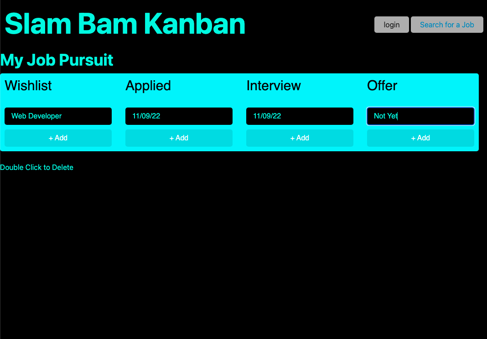

# Group 5
# Project 2

## Description
A real-world front-end application developed using the skills and technologies learned in previous modules (deployment, interactivity, client-side storage, responsive design, and polished UI). Application will be used as part of professional porfolio to show potential employers.

## Table of Contents
* [Mock Up](#Mock-Up)
* [Group Members](#Group-Members)
* [Technologies Used](#Technologies-Used)
* [API](#API's)
* [Project Requirements](#Project-Requirements)
* [Concept](#Concept)
* [Presentation Requirements](#User-Story)
* [Technical Acceptance Criteria](#Technical-Acceptance-Criteria)
* [Concept](#Concept)
* [Deployment](#Deployment)
* [Repository Quality](#Repository-Quality)
* [Application Quality](#Application-Quality)
* [Presentation](#Presentation)
* [Collaboration](#Collaboration)
* [Submission](#Submission)

## Mock Up
The following image shows the web application's appearance and functionality:

## Group Members 
* Alexander Defrese 
* Brian Lockhart
* Nina Serebryakova
* Zack Pokorny

## Technologies Used
* HTML
* CSS
* Node.js
* Express.js
* JavaScript
* RESTful API
* MySQL
* Heroku
* Git

## API's
* 

### Project Requirements
* Your project should fulfill the following requirements:
1. Use Node.js and Express.js to create a RESTful API.
2. Use Handlebars.js as the templating engine.
3. Use MySQL and the Sequelize ORM for the database.
4. Have both GET and POST routes for retrieving and adding new data.
5. Be deployed using Heroku (with data).
6. Use at least one new library, package, or technology that we haven’t discussed.
7. Have a polished UI.
8. Be responsive.
9. Be interactive (i.e., accept and respond to user input).
10. Have a folder structure that meets the MVC paradigm.
11. Include authentication (express-session and cookies).
12. Protect API keys and sensitive information with environment variables.
13. Have a clean repository that meets quality coding standards (file structure, naming conventions, best practices for class/id naming conventions, indentation, quality comments, etc.).
14. Have a quality README (with unique name, description, technologies used, screenshot, and link to deployed application).
15. Finally, you must add your project to the portfolio that you created in Module 2.

# Concept
* Given I am user who wants to 
* When I enter
* Then I am presented with 
* Given  I am a user who v
* When I click on 
* Then I am presented with 
* Given I am a user who wants to 
* When I view a
* Then I also 
* Given I am a user who 
* When I view 
* Then I am presented with

### Presentation Requirements
1. Elevator pitch: A one-minute description of your application.
2. Concept: What is your user story? What was your motivation for development?
3. Process: What were the technologies used? How were tasks and roles broken down and assigned? What challenges did you encounter? What were your successes?
4. Demo: Show your stuff!
5. Directions for future development.
6. Links to the deployed application and the GitHub repository.

### Technical Acceptance Criteria
* Satisfies all of the acceptance criteria.
- Application uses a Node and Express back end and uses both GET and POST routes for retrieving and adding new data.
- Application has a folder structure that meets the MVC paradigm and uses Handlebars.js as the template engine.
- Application is backed by a MySQL database with a Sequelize ORM and protects API keys and sensitive information with environment variables.
- Application includes user authentication (express-session and cookies).
- Application uses at least one new library, package, or technology not covered in class.

### Concept
* Application should be a unique and novel idea.
* Your group should clearly and concisely articulate your project idea.

### Deployment
* Application deployed at live URL and loads with no errors.
* Application GitHub URL submitted.
* Portfolio at live URL submitted, featuring project.

### Repository Quality
* Repository has a unique name.
* Repository follows best practices for file structure and naming conventions.
* Repository follows best practices for class/id naming conventions, indentation, quality comments, etc.
* Repository contains multiple descriptive commit messages.
* Repository contains quality readme with description, screenshot, link to deployed application.

### Application Quality
* Application user experience is intuitive and easy to navigate.
* Application user interface style is clean and polished.
* Application is responsive.

### Presentation
1. Your group should present using Powerpoint or a similar presentation software.
2. Every group member should speak during the presentation.
3. Project Presentation Template: https://docs.google.com/presentation/d/10QaO9KH8HtUXj__81ve0SZcpO5DbMbqqQr4iPpbwKks/edit#slide=id.p
4. PowerPoint Presentation Document: 

### Collaboration
* There are no major disparities in the number of GitHub contributions between group members.

### Submission
* Date Submitted: 11/09/22
* The URL of the deployed application: 
* The URL of the GitHub repository that contains your code: 
* The URL of your portfolio, with your project added to it:   
* PowerPoint Presentation Document: 
